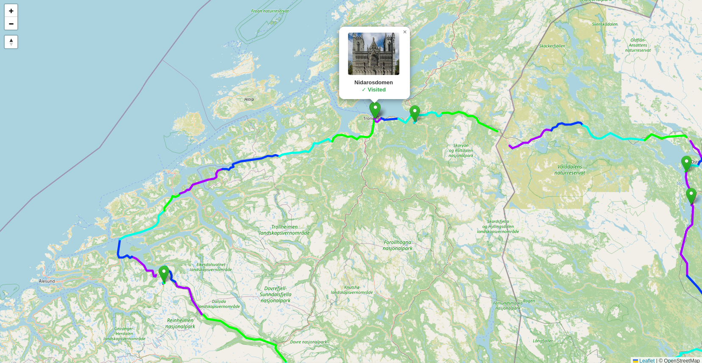
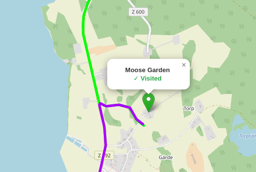

# Trip Tracker V1

## Architecture

**Backend** - [Express](https://expressjs.com/), [SQLite](https://sqlite.org/)

**Frontend** - [Svelte](https://svelte.dev/), [Leaflet](https://leafletjs.com/)

**Android App** - [Capacitor](https://capacitorjs.com/)

## Description

Trip Tracker is a full stack application that tracks your roadtrip or hikes using your phone.




## Features

- Website for sharing and viewing trips and editing locations and GPS traces
- Mark locations as visited
- Automatically pulls wikipedia images for locations
- Current speed and Speed limit in real time
- Username & Password login required one time to start tracking and editing
  - Saved to device

## Privacy

This is a public sharing site: **anyone with the URL can see all trips and all
GPS points**, including the live position of whoever is currently tracking
(updated roughly every 10 seconds while a trip is being recorded). Do not
record trips in locations you do not want public.

Trips can be hidden from public, and deleted entirely.

## API access

| Method + path | Auth | Purpose |
| --- | --- | --- |
| `GET /api/path` (`?trip_id=N` optional) | Public | Full GPS history |
| `GET /api/trips` (`?trashed=true` optional) | Public | Trip list |
| `GET /api/locations`, `GET /api/visited`, `GET /api/visitors` | Public | Locations / visited marks / visitor count |
| `GET /api/live-tracking` | Public | Last known live position |
| `GET /api/speed-limit` | Login required | HERE speed-limit proxy (paid API key) |
| `POST /api/trips/:id/hidden` | Login required | Toggle trip hidden from public |
| `POST/PUT/DELETE` on any `/api/*` route | Login required | All writes (points, trips, locations, splice) |

Unknown `/api/*` routes return 404, never the web app. Public GETs exclude
trips (and their GPS points, locations, and live position) that are hidden
from public viewing — hidden trips are only served when the request is
authenticated.

## Setup Guide

1. ### Clone Repo

   ```bash
    git clone https://github.com/CataDev0/trip-26.git && cd trip-26/
    ```

1. ### Create environment file

    ```bash
    cp .env.example .env
    ```

1. ### Edit the environment file with your desired username and password

    \* *For logging into the tracker suite*

    ```bash
    nano .env
    ```

    **Note:** `ADMIN_USERNAME` and `ADMIN_PASSWORD` are required
    ```bash
    ADMIN_USERNAME=
    ADMIN_PASSWORD= 
    ```

    **Optionally:** Add [HERE](https://docs.here.com/geocoding-and-search/docs/get-started-with-here-geocoding-and-search-api-v7) API key for speed limit functionality - Using the Geocoding and Search API

    **Other optional variables:**

    ```bash
    # Comma-separated origins allowed to call the API cross-origin.
    # Unset = no cross-origin access (fine for the normal web + Android setup)
    CORS_ORIGINS=https://example.com

    # Set to 1 when running behind a reverse proxy so rate limits use the real client IP
    TRUST_PROXY=0

    # Rate limits per IP per minute (defaults shown)
    RATE_LIMIT_PUBLIC_PER_MIN=120
    RATE_LIMIT_WRITE_PER_MIN=30
    RATE_LIMIT_SPEED_PER_MIN=30

    # Default is 25mb - Required for /api/path endpoint which can use several mbs when replacing entire trip
    JSON_BODY_LIMIT=25
    ```

1. ### Back up the database (before deploying)

    ```bash
    npm run backup
    ```

    Writes `trip.db.<timestamp>.bak` next to `trip.db`. Run it before every deploy.

1. ### Install dependencies and run vite build

    ```bash
    npm i && npm run build
    ```

   ### *Build the Android app*

    1.

    ```bash
    cd frontend && npx cap sync android
    ```

    1. Run Android Studio and open `trip-26/frontend/android` folder
    1. Run build - *Assemble 'app' Run Configuration*
    1. Connect your phone with USB Debugging or WiFi Debugging enabled
    1. Run the app on your phone

    **The app should now be installed and signed by Android Studio**

1. ### Run the backend server using node.js

    **Example using systemd unit:**

    Make a new unit file

    ```bash
    sudo nano /etc/systemd/system/triptracker.service`
    ```

    Replace `YOURUSER` with your `$USER`

    And correct WorkingDirectory pointing to the cloned repository folder

    ```systemd
    [Unit]
    Description=Trip Tracker Node.js App
    After=network.target

    [Service]
    Type=simple
    User=YOURUSER
    WorkingDirectory=/home/YOURUSER/trip-26
    # Use the absolute path to your node executable
    # You can find it by running `which node`
    ExecStart=/usr/bin/node server.js
    Restart=on-failure
    RestartSec=10
    Environment=NODE_ENV=production
    Environment=PORT=3000

    [Install]
    WantedBy=multi-user.target
    ```

    Reload systemd units

    ```bash
    sudo systemctl daemon-reload
    ```

    Enable autostart and start the service

    ```bash
    sudo systemctl enable triptracker && sudo systemctl start triptracker
    ```

    Reach the app at <http://localhost:3000/>

## Contribute

Contributions are welcome and are important to polish the software

### Suggested contributions

- iOS app support with capacitor
  - I dont have iOS, nor do I know how to build and sign an iOS app
- ~~Group trips together~~ PR #3 !3
  - Option to filter based on group trips
- Better editing tools
  - Clean up messy traces etc.
- Better accuracy
  - Background tracking
- Plan trips / Route planning
  - Use an API? Or make a complicated route planning tool
- Trip replay tool
  - Based on gps_trace timestamps
  - Show sped up replay in detail
  - Smooth animation for each node
  - Both trips and trip clusters
